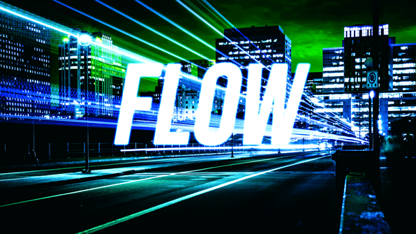

# FLOW

#### M2 :
*LATBI Rendy, COURBIER Raphaël*
#### LD :
*AMBROISE Aurélien*

## Pitch :

Flow est un Runner 3D Die & Retry rythmé. En vue troisième personne, le joueur incarne un personnage qui se déplace dans une ville. Dans cette dernière, il doit terminer le plus rapidement possible un niveau, son score final étant basé dessus. Le joueur à la possibilité de se déplacer dans 3 couloirs et sur 3 hauteurs. La vitesse du jeu s’accélère quand le joueur récupère un bonus, il n’y a pas d’accélération mais un système de palier de vitesse et la distance entre les obstacles est rythmée et accompagnée de la musique.

## Fiche signalétique :
- Thématique : Roller street.
- Genre : Runner / Die and Retry.
- Espace : Linéaire.
- Durée : 30s /1min par niveau.
- Items : Collectibles Simples.
- Graphismes : 3D (Low ou Medium Poly).
- Technologie : PC et moteur Unity.
- Joueur : 1 Joueur.
- Cible : Casual et Hardcore Gamer (Survivor, Daredevil et Achiever)
- Features : Jump, Wall ride, Slide.

## Conditions de victoire et défaites:
- Le joueur gagne dès qu'il finit le niveau.
- Le joueur perd dès qu'il n'a plus de points de vie.

## Commandes et Features :
### CORE GAMEPLAY :
L'espace de jeu se compose d'un tableau de 3x3.
La hitbox du personnage fait 1 bloc de large et 2 de haut.

---     ---  
---     -#-  
---     -#- < **Personnage**  

### Z : JUMP
- La touche Z permet au joueur de sauter au dessus de certains obstacles
- La hitbox du personnage diminue et passe à 1x1.

---     -#-  
000     000  
000     000  

### Q : LEFT
- La touche Q permet au joueur de se déplacer d'un couloir vers la gauche
- Si le joueur est sur le couloir le plus à gauche, il se mettra à courir sur le mur.
- La hitbox du personnage diminue et passe à 1x1.

000     000  
-00     #00  
000     000  

### D : RIGHT
- La touche D permet au joueur de se déplacer d'un couloir vers la droite
- Si le joueur est sur le couloir le plus à droite, il se mettra à courir sur le mur.
- La hitbox du personnage diminue et passe à 1x1.

000     000  
00-     00#  
000     000  

### S : SLIDE
- La touche S permet au joueur de glisser en dessous de certains obstacles
- La hitbox du personnage diminue et passe à 1x1.

000     000  
000     000  
---     -#-  

### BONUS
- Un bonus peut être attrapé en rentrant en colission avec lui, augmentant le palier de vitesse du joueur et de la musique, donc de la difficulté.

### OBSTACLES
- En heurtant un osbtacle, le joueur perd 1 vie.
- En heurtant un osbtacle, le joueur perd X paliers de vitesse.

## Divers :
### MENU PRINCIPAL :
- PLAY
- QUIT

### ECRAN DE FIN :
- "YOU WON ! SCORE : 10000" / "GAME OVER"
- PLAY AGAIN / QUIT

## Répartition des tâches :
- Aurélien : Programmation : Gestion des collisions et vitesse du jeu, bonus
- Raphaël : Programmation : Génération procédurale des Obstacles
- Rendy : Programmation : Player Controller
- Nous travaillons tous sur l'aspect Game/Level Design et sur l'aspect Programmation
