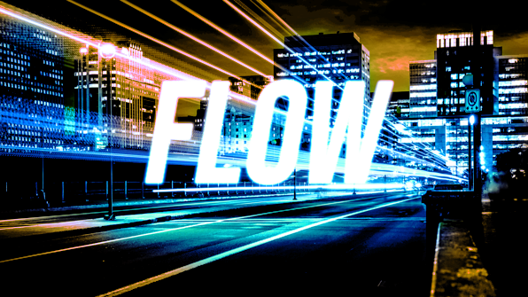

# FLOW
Gamagora 2019 - ProgJV - Flow

#### Participants au projet : 
***LATBI Rendy, COURBIER Raphaël***, *Aurélien Ambroise*

## Fiche signalétique :
*Flow est un Runner 3D Die & Retry rythmé. En vue troisième personne, le joueur incarne un
personnage qui se déplace dans une ville en évitant des obstacles. Dans cette dernière, il doit esquiver un maximum d'obstacles possible.*   
Les obstacles sont synchronisés sur la musique dans le mode Rythm et générés aléatoirement dans le mode Endless. 
Le joueur à la possibilité de se déplacer dans 3 couloirs et sur 3 hauteurs.  
L'espace de jeu se compose d'un tableau de 3x3.  
La hitbox du personnage fait 1 bloc de large et 2 de haut.  
Il est possible de se déplacer de 4 manières différentes :
- **Déplacement latéral** ( Q/D ou ←/→ ) : pour changer de couloirs
- **Saut** (Z ou ou flèche haut) : permet de rester dans la case hauteur la plus élevée (1 seul bloc de haut
au lieu de 2)
- **Glisser** (S ou flèche bas) : permet de rester dans la case hauteur la plus faible (1 seul
bloc de haut au lieu de 2)
- **Wallrun** ( Q/D ou ←/→ en direction du mur) : permet de rester dans la case de hauteur
médiane ( 1 seul bloc de haut au lieu de 2)

## Modes de jeu :
Lors de la conception du jeu, on avait prévu de seulement réaliser un seul mode de jeu : un
mode “Rythm” avec des obstacles générés aléatoirement sur le BPM de la musique, le but était
alors de ramasser des bonus d’augmenter la vitesse de la musique et du joueur et celui-ci avait
alors pour objectif de finir le niveau le plus rapidement possible.   
Après avoir implémenté ce mode de jeu on s’est assez vite rendu compte que tout d’abord il était très compliqué de
synchroniser des obstacles sur le tempo de la musique car en général il avait tendance à
changer et que cela était très monotone. De plus la musique devenait inaudible lorsqu’elle était
trop accélérée et il devenait très compliqué de contrôler le joueur lorsque la vitesse devenait
trop élevée.  
On a alors décidé de modifier le concept du mode Rythm, et d’ajouter un autre mode de jeu car on a travaillé plus vite que prévu. 
On a donc réalisé le mode endless (infini) en plus.

## Mode Rythm :
L’objectif du mode Rythm est de proposer une expérience unique à l’utilisateur, un mix entre un
jeu de rythme et un Runner, ce qui donne une combinaison très intéressante.   
Dans ce mode de jeu les obstacles sont fixes, ils sont disposés sur le rythme de la musique, à
chaque fois que le joueur esquive un obstacle, son score augmente mais aussi son compteur
de combo, grâce à ça il est ainsi possible d’augmenter son multiplicateur de score à certains
paliers.   
La difficulté de ce mode de jeu est fixe puisqu’elle dépend des obstacles directement. Le seul
niveau de Rythm actuellement dans le jeu est assez difficile, il est présent pour offrir un
challenge intéressant aux joueurs qui souhaitent avoir un peu plus que le Endless.   
L’objectif est de terminer le niveau en esquivant un maximum d’obstacles et d’avoir un score
parfait ! Il est possible de perdre en faisant une mauvaise performance (on peut alors rejouer ou
retourner au menu principal), en prenant plusieurs obstacles à la suite sans rien esquiver.

## Mode Endless :
Le mode Endless est un classique, il a été vu maintes et maintes fois et revisité à de
nombreuses occasions, en général c’est un format qui convient bien à des jeux mobiles.
  
Dans ce mode de jeu les obstacles sont générés aléatoirement à un intervalle fixe qui est basé
sur le rythme de la musique de fond qui tourne en boucle, ils sont disposés sur le rythme de la
musique, à chaque fois que le joueur esquive un obstacle, son score augmente mais aussi son
compteur de combo, grâce à ça il est ainsi possible d’augmenter son multiplicateur de score à
certains paliers.
  
La difficulté de ce mode de jeu est variable puisqu’elle dépend des obstacles directement, et
ceux-ci sont générés aléatoirement. Néanmoins au fur et à mesure du temps on a des
obstacles de difficulté de plus en plus grande. En effet il existe 4 difficultés d’obstacles
différentes : facile, normal, moyen, et difficile. Plus on avance plus la proportion d’obstacles de
difficulté supérieure générée augmente. On fait tout de même en sorte de toujours générer des
obstacles de difficulté inférieure pour éviter que le jeu ne devienne trop monotone et quasiment
injouable.
  
L’objectif est de réaliser le score le plus grand possible, et de survivre un maximum de temps.
Dans ce mode de jeu on peut ramasser des bonus qui augmentent la tolérance en terme
d’échec : par exemple au départ on perd en prenant 2 obstacles à la suite, si on ramasse un
bonus on perd en prenant 3 obstacles à la suite… etc

## Répartition des tâches :
- Aurélien : Bonus, Difficulté Endless
- Raphaël : Score/ComboManager, Interface, Inputs, Generation d'Obstacles Endless
- Rendy : Character Controller, Animations, Gestion Sonore, Particules, Post-Processing, Camera, Menu, Mode de jeu Rythm 
